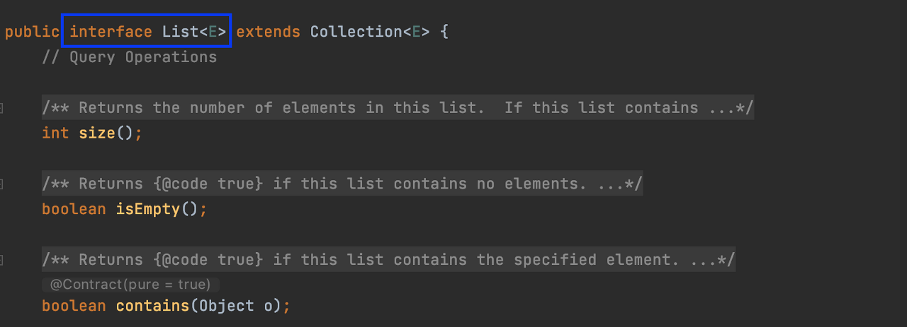
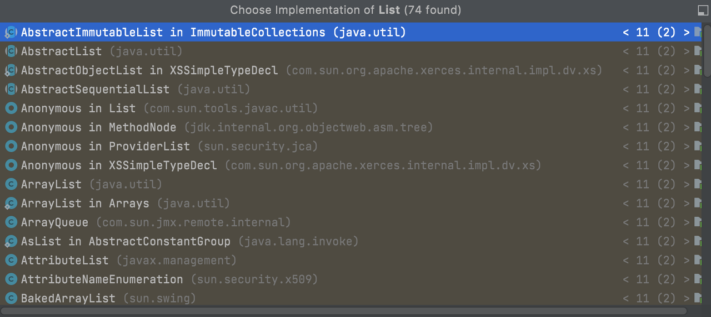
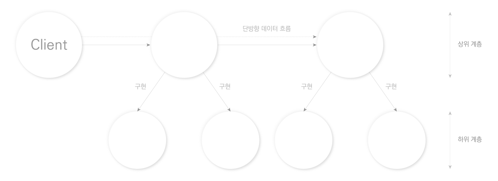
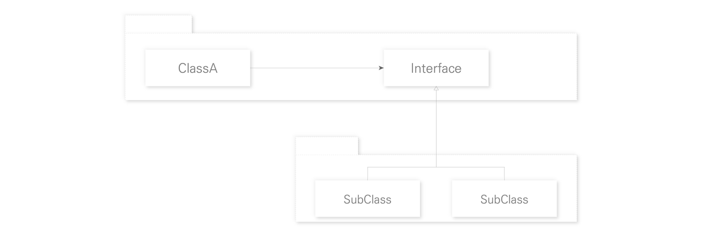
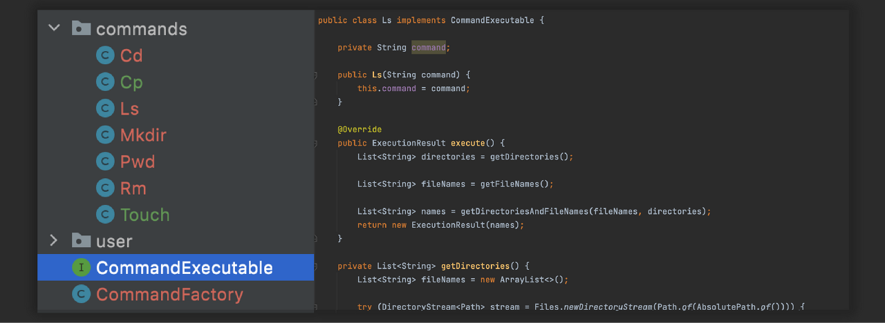

# 추상계층

추상 클래스와 interface 수업을 듣고 이를 학습한 저장소 입니다.
      

## 1. 추상 계층과 의존성 / 사용이유

객체지향 프로그래밍에서 객체들은 메시지로만 소통합니다. 이 과정에서 메시지 전송자는 수신자를 몰라도 되며, 반대로 수신자는 전송자를 몰라도 됩니다.
 

      

객체끼리 소통하는 과정에서 자연스럽게 객체 사이의 의존관계가 생길 수 밖에 없는데 이 의존관계는 가급적 단방향으로, 그리고 변하지 않는 것에 의존하는 것이 좋습니다. 변하지 않는 것에 의존한다는 것은 추상 클래스
혹은 인터페이스에 의존한다는 것인데요, 저번 수업시간에 배웠던 List가 대표적 사례입니다. List는 구현체를 ArrayList에서 LinkedList로 바꾸어도 아무런 오류가 발생하지 않습니다.
 

      

이것이 가능했던 이유는 List도 사실 인터페이스이기 때문입니다.
 

      

따라서 위의 리스트 예제를 아래와 같이 해석할 수 있습니다.` Stack이라는 변하는 클래스가 변하지 않는 인터페이스 List에 의존하고 있다.`
이는 Stack 클래스의 내부 구현을 봐도 알 수 있는데요, [Stack](https://docs.oracle.com/javase/7/docs/api/java/util/Stack.html) 은 구체 클래스이며
Vector을 상속합니다. 또한 Vetor는 List를 implement하고 있습니다.
 

      

List의 구현체는 ArrayList와 LinkedList 뿐만 아니라 다 알기 힘들 정도로 많지만, 변하지 않는 List 인터페이스에 의존하게 되면 구현체가 바뀌더라도 크게 영향을 받지 않을 수 있습니다.
 

  

      

이처럼 객체 간 의존성이 변하지 않는 것에 의존하게 되면 변경에 유연해지게 되며, 이를 통해 변화의 연쇄를 끊기 쉬워집니다. 변화의 연쇄란 하나를 수정했을 때 그로 인해 다른 것들을 수정해야 하는 것을 말합니다.

처음으로 돌아가 객체지향 프로그램에서 가급적 단 방향으로, 그리고 변하지 않는 것에 의존하게 되면 메시지의 흐름에서 각 인터페이스의 구현체들을 상황에 맞게 추가하거나 변경하기만 하면 됩니다. 정확한 구현체를 몰라도
되기 때문에 변경에 유연해지며 심지어 (부품처럼) 새로운 클래스로 갈아 끼워도 상관없습니다.
  

      

## 2. 장점

인터페이스를 사용하면 다양한 이점이 존재하지만 가장 대표적으로 변경의 유연성을 얻을 수 있습니다. 만약 인터페이스를 사용하지 않고 구체적인 구현체에 의존하게 되면 하나의 클래스를 수정하거나 추가했을 때 그로인해
연관된 다른 곳의 모든 코드를 수정해야할 수 있습니다. 아래 그림처럼 제일 위의 한 부분만 수정했는데도 그와 연계된 아래(혹은 위)까지 영향을 미치게 되는 것입니다.

 

      
자바에서는 이런 변화의 연쇄를 끊기 위해 추상 클래스 또는 인터페이스를 사용합니다. 객체 인스턴스를 직접 만들면 구현 클래스에 의존해야 하지만, 인터페이스를 사용하게 되면 타입 "계층"을 만들어 완충작용을 할 수
있기 때문입니다. * 구체적으로, 명확하게 지명 되던 클래스 들이 "계층"이라고 뭉뚱그려진다고 이해하면 쉬울 것 같습니다. ArrayList와 LinkedList는 ArrayList, LinkedList와 같이 각각
구체적으로 지명되던 클래스지만 List라는 타입으로 뭉뚱그려 부를 수 있는 것입니다.

이렇게 되면 변경 사항에 대한 직접적인 영향을 완충할 수 있습니다. 왼쪽 그림처럼 상위 클래스에서 구체적인 하위클래스를 지명하게 되면, 해당 클래스(구현체)를 변경할 때 부작용이 곧바로 상위 클래스로 전달됩니다.
하지만 오른쪽 처럼 계층을 두게 되면 하위 클래스의 변경사항에 대한 여파를 직접적으로 받지 않으며, 심지어 구현체의 세부 사항에 대해 모른 채 인터페이스에 의존하며 개발할 수 있게 됩니다.

  

      

변하지 않는 것에 의존하기 때문에 구현체의 로직을 필요할 때 언제라도 바꿀 수 있고, 이는 클라이언트(객체를 사용하는 측)에 전혀 영향을 미치지 않습니다. 따라서 이를 통해 변화에 유연한 코드를 작성할 수 있습니다.

      

뿐만 아니라 이 경우 하위 클래스들이 인터페이스에 의존하게 되면서 "저 수준의 모듈이 고 수준의 모듈에 의존하는" 의존성 역전의 원칙이 발생하게 됩니다. 이렇게 되면 기존과 반대로, 변하는 구체 클래스 들이 변하지
않는 인터페이스에 의존하면서 자유롭게 구현체를 변경할 수 있습니다. 앞서 예시로 들었던 List에서, ArrayList대신 List의 다른 어떤 구현체로 바꾸더라도 영향을 받지 않는 것입니다. *물론 상황따라
구현체의 적절한 자료구조를 선택해서 사용해야 할 필요는 있습니다.
 

      

## 3. 단점

물론 단점도 존재합니다. 많은 클래스가 생성되거나 프로젝트의 복잡도가 증가하게 되고, 전체 프로젝트를 한 눈에 파악하기 힘들어집니다. 인터페이스를 사용하게 되면 하나의 인터페이스를 기준으로 다양한 클래스들이 타입
계층 을 형성하게 되지만, 이 [타입 계층](https://github.com/devjun10/CodeSquad_Study/tree/main/content/interface/jun/interface) 내에 속한
클래스들이 각각의 역할과 책임을 가져야 하기 때문입니다.

아래는 이번 주 과제로 나왔던 쉘 만들기 미션 중 일부인데요, Executable 이라는 인터페이스를 정의하고 각각의 클래스를 만들어 "명령 수행"이라는 행동을 기준으로 타입 계층을 형성했습니다. 각각의 역할과
책임이 나눠진 것은 좋았지만 과제가 진행되면서 이를 관리하기 조금씩 힘들어졌습니다. 이처럼 많은 연관 클래스가 생겨나서 프로젝트의 복잡도가 증가하는 단점이 존재합니다.

 

* Shion TA의 조언을 받았는데, 배우는 과정에서는 FM대로 최대한 잘게 나누고 쪼개되는 것이 좋을 것 같다고 해서 이를 반영했습니다.

      

# 4. 정리 요약 및 키워드

- 인터페이스를 사용하는 이유는 다양하지만, 가장 큰 이유는 다형성을 활용한 변경에 유연한 코드를 작성하기 위함이다.

- 인터페이스를 사용하면 타입 계층을 형성할 수 있으며, 변경에 유연하게 대응할 수 있다.

- 변하지 않는 것에 의존해야 한다. 변하는 것에 의존하면 안된다.

아래는 호눅스의 수업시간 때 배웠던 키워드이며, 이를 바탕으로 스터디를 진행했습니다.
  

`# 추상 메서드가 하나라도 있으면 추상 클래스가 된다.`      `# 추상클래스는 객체를 만들 수없다.`      `# 추상클래스의 확장`
`# Director Super # 당장 결정하지않은 경우` `# 인터페이스는 특별한 형태의 추상 클래스` `# 인터페이스도 추상 객체다.`
`# eatable과 같이 동작의 상태를 결정하는 용어`  `# 동적 할당`

